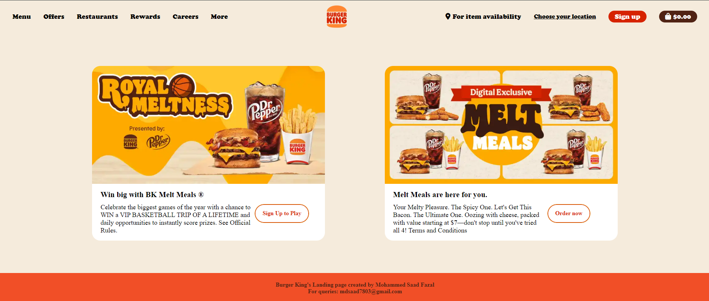

# 🍔 Burger King - Landing Page

Welcome to the **Burger King Landing Page**! A sleek and responsive webpage inspired by the delicious flavors of Burger King. 🍟🔥

## 🚀 Live Demo
👉 [Click here to view the deployed version](https://mdsaad07.github.io/Burger-King/) 🎯

---

## 📸 Screenshots
Take a sneak peek at the landing page:

---

## 🎨 Features
✅ **Fully Responsive** 📱💻  
✅ **Modern UI Design** 🎨  
✅ **Smooth Navigation** 🚀  
✅ **Attractive Call-To-Action (CTA) Buttons** 🔥  
✅ **Fast & Optimized Performance** ⚡  

---

## 🛠️ Technologies Used
- **HTML5** 🏗️
- **CSS3** 🎨
- **Font Awesome Icons** 🔠

---

## 👨‍💻 Developed By
👤 **Mohammed Saad Fazal**  
📩 Email: [mdsaad7803@gmail.com](mailto:mdsaad7803@gmail.com)  
🔗 [LinkedIn](https://www.linkedin.com/in/mohammed-saad-fazal-a779371b5/) | [GitHub](https://github.com/MdSaad07)  

---

## 📜 License
This project is for educational purposes only and does not represent an official Burger King website.

💡 _Feel free to fork and improve! Contributions are welcome._ 😃
